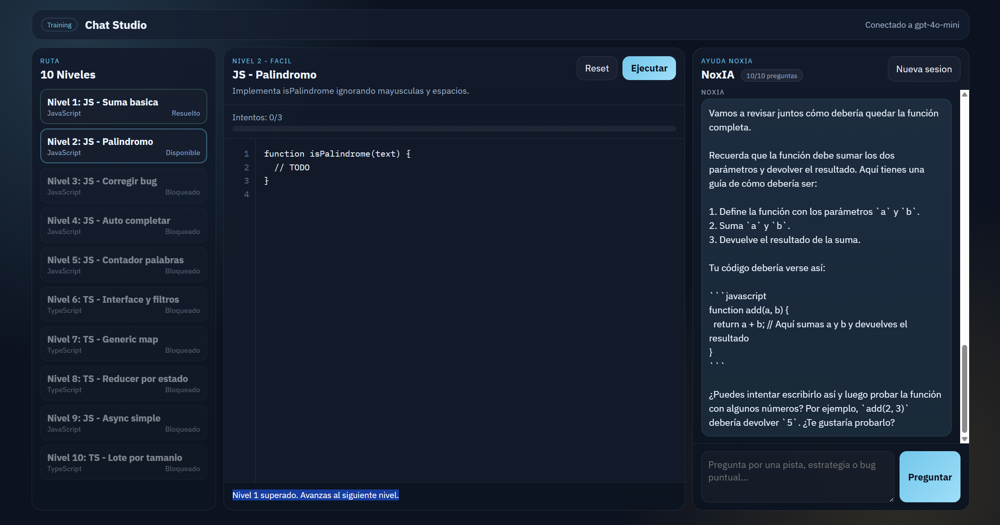

# NoxIA Platform

Juego de 10 niveles de programacion con JavaScript/TypeScript, compilacion en navegador y chat de ayuda con IA.



## Caracteristicas

- 10 niveles progresivos (facil, medio, dificil).
- Niveles bloqueados/desbloqueados por progreso.
- Boton `Ejecutar` valida compilacion y pruebas del nivel.
- Si superas un nivel antes de 3 intentos: desbloquea 2 niveles.
- Si fallas 3 intentos: se revelan las respuestas ofuscadas de la IA para ese nivel.
- Chat de ayuda contextual por nivel, sin autocompletado automatico del editor.

## Requisitos

- Python 3.10+
- Token de GitHub Models

## Ejecutar

1. Crea entorno virtual e instala dependencias:

```bash
python -m venv .venv
source .venv/Scripts/activate
pip install -r requirements.txt
```

2. Configura variables:

```bash
cp .env.example .env
```

3. Edita `.env` con tu token real en `GITHUB_TOKEN`.

4. Inicia la app:

```bash
python src/main.py
```

5. Abre:

- http://127.0.0.1:8010

## Notas tecnicas

- TypeScript compila en cliente usando `typescript.js` desde CDN.
- La validacion de niveles se hace en el navegador con tests ocultos.
- El backend solo gestiona chat con GitHub Models y sirve archivos estaticos.
